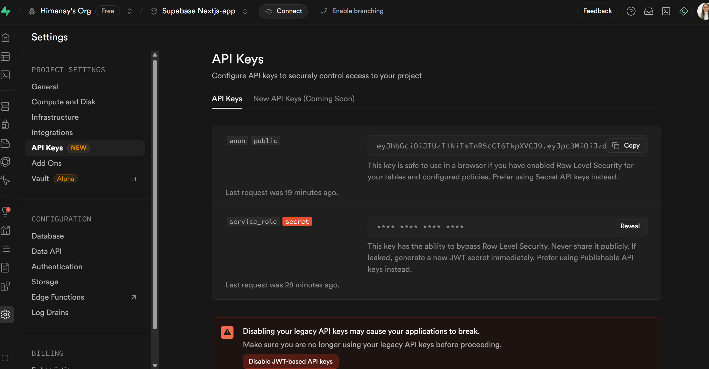
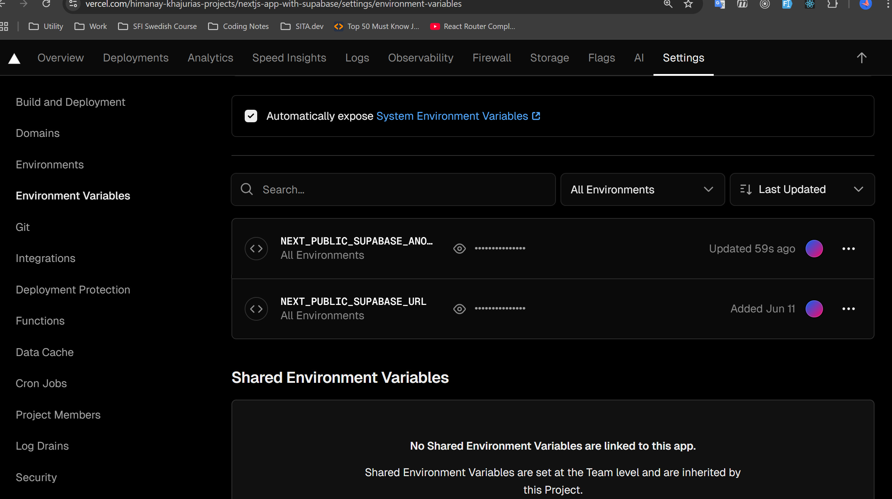

### PACKAGES:

- Bootstrap
- To display messages - react hot toast
- To display alert messages - sweetalert2
- Form validation - yup
- react-hook-form
- @hook-form/resolvers
- @supabase/supabase-js
  INSTALL: **npm install bootstrap react-hot-toast sweetalert2 yup react-hook-form @hookform/resolvers @supabase/supabase-js i
  **

## INITIAL FILE SETUP:- Files and Folders required:

**.env.local file** - file used to create the environmental variable of this application, supabase keys - key to access the URL. .env.local file just storing the value and it is secure and privacy
**lib folder** - returns supabase client object. To access the supabase keys, we import them in lib folder to access them
**context** - we will be having resusable functions, custom hooks
**components** - resusable components (eg. navbar)
**app** - need to create manually:-
/auth
-login
-register
-profile
-dashboard

## ROUTER

http://localhost:3000/auth/profile
http://localhost:3000/auth/login

```jsx
  import { useRouter } from "next/navigation";  //import router
export default function ProfilePage() {
  const router = useRouter();   //stored in variable

  const handleEditProfile = () => {
    router.push("auth/editProfile");   //give the routing
  };

  return (
    <>
      <div style={{ marginTop: "6px", marginLeft: "20px" }}>
        <Link
          className="btn btn-primary btn-sm"
          href="/auth/editProfile"
          onClick={handleEditProfile}
        >
          Edit
        </Link>
      </div>
    </>
  );
}
```

### components folder: inside we have

**nav bar**
**loader** - used to have a loading icon, whenever something loading
**footer**

## Context Component: used to define reusable functions

## Supabase Authentication - Import Subase Client

```jsx
//Login
import { supabase } from "@/lib/SupabaseClient";
import toast from "react-hot-toast";

export default function LoginPage() {
  const handleSocialOauth = async (provider: "google" | "github") => {
    const { data, error } = await supabase.auth.signInWithOAuth({
      provider,
      options: {
        redirectTo: `${window.location.origin}/auth/dashboard`, // Adjust the redirect URL as needed
      },
    });
    if (error) {
      toast.error("Error during OAuth sing-in");
    }
  };
  return (
    <>
      <Navbar />
      <div className="container mt-5">
        <div className="text-center mt-3">
          <button
            className="btn btn-danger mx-2"
            onClick={() => handleSocialOauth("google")}
          >
            Google
          </button>
          <button
            className="btn btn-dark mx-2"
            onClick={() => handleSocialOauth("github")}
          >
            GitHub
          </button>
        </div>
      </div>
      <Footer />
    </>
  );
}
```

## When LoggedIn: local and session storage

- We get get Access Token(long string) when user login from google, github or any other social platform like slack, gitlab.
- The **token value in the URL**: save either in local or session storage so that we can use it later
- **local storage**: stored in the browser forever until we manualy deleted
- **session storage**: stored only while the brower tab is open
- ==user logs in -> gets token -> stored in local -> later use the token to make secure requests==
- **secret pass (TOKEN value)** that proves user is logged in
- supabase client object - to read the session value

## Supabase user datatable: sortring the registered users

- follow up the register component. it covers:-

1. form Validation: `yup`; schema: form validation

- { useForm } -
- { yupResolver }
- { supabase }
- { toast }
- { useRouter }

2.  Supabase -> project -> Authentications -> Users (it stores all registered users)

```jsx
import * as yup from "yup";
import { useForm } from "react-hook-form";
import { yupResolver } from "@hookform/resolvers/yup";
import { supabase } from "@/lib/SupabaseClient";
import toast from "react-hot-toast";
import { useRouter } from "next/navigation";

const schema = yup.object().shape({
  displayName: yup.string().required("Display Name is required"),
  email: yup.string().email("Invalid email").required("Email is required"),
  phone: yup.string().required("Phone number is required"),
  gender: yup
    .string()
    .required("Gender is required")
    .oneOf(["Male", "Female", "Other"]),
  password: yup
    .string()
    .min(6, "Password must be at least 6 characters")
    .required("Password required"),
  confirmPassword: yup
    .string()
    .required("Confirm Password is required")
    .oneOf([yup.ref("password")], "Passwords must match"),
});

export default function RegisterPage() {
  const router = useRouter();
  const {
    register,
    handleSubmit,
    formState: { errors, isSubmitting },
  } = useForm({
    resolver: yupResolver(schema),
  });
  const onsubmit = async (formdata: any) => {
    console.log("Hello");
    // console.log("Form submitted:", formdata);
    const { displayName, email, password, gender, phone } = formdata;
    const { data, error } = await supabase.auth.signUp({
      email,
      password,
      options: {
        data: {
          displayName,
          gender,
          phone,
        },
      },
    });
    if (error) {
      toast.error("Failed to register the user");
    } else {
      toast.success("User registered successfully");
      //Optionally redirect to login or home page
      router.push("/auth/login");
    }
  };
  return (
    <>
      <Navbar />
      <div className="container mt-5">
        <h2 className="text-center">Register</h2>
        <form onSubmit={handleSubmit(onsubmit)} className="w-50 mx-auto mt-3">
          <div className="row mb-3">
            <div className="col-md-6">
              <label className="form-label">Display Name</label>
              <input
                type="text"
                className="form-control"
                {...register("displayName")}
              />
              <p className="text-danger">{errors.displayName?.message}</p>
            </div>
            <div className="col-md-6">
              <label className="form-label">Email</label>
              <input
                type="email"
                className="form-control"
                {...register("email")}
              />
              <p className="text-danger">{errors.email?.message}</p>
            </div>
          </div>

          <div className="row mb-3">
            <div className="col-md-6">
              <label className="form-label">Phone</label>
              <input
                type="text"
                className="form-control"
                {...register("phone")}
              />
              <p className="text-danger">{errors.phone?.message}</p>
            </div>
            <div className="col-md-6">
              <label className="form-label">Gender</label>
              <select className="form-control" {...register("gender")}>
                <option value="Male">Male</option>
                <option value="Female">Female</option>
                <option value="Other">Other</option>
              </select>
              <p className="text-danger">{errors.gender?.message}</p>
            </div>
          </div>

          <div className="row mb-3">
            <div className="col-md-6">
              <label className="form-label">Password</label>
              <input
                type="password"
                className="form-control"
                {...register("password")}
              />
              <p className="text-danger">{errors.password?.message}</p>
            </div>

            <div className="col-md-6">
              <label className="form-label">Confirm Password</label>
              <input
                type="password"
                className="form-control"
                {...register("confirmPassword")}
              />
              <p className="text-danger">{errors.confirmPassword?.message}</p>
            </div>
          </div>

          <button type="submit" className="btn btn-primary w-100">
            Register
          </button>
        </form>

        <p className="text-center mt-3">
          Already have an account? <a href="/auth/login">Login</a>
        </p>
      </div>
      <Footer />
    </>
  );
}
```

# Session 4

- **setPreviewImage(URL.createObjectURL(event.target.files[0])) - to set the image from local**
- **Login Authentication**: supabasr user table
- **Profile**: read the metadata while we login and display in the respective field
- custom login
- registeration process
- profile
- CRUD: **Create Operation** partially completed
- Create a product table in supabase
- Added foreign key relation between the product table and auth.user table
- Created a storage in supabase for storing the images - supabase storage concept
- Created the URL.createObjectURL(for image preview): eg. \*setPreviewImage(URL.createObjectURL(event.target.files[0]))
- Handled the **choose file button** - uploading the file from local; see below example

```jsx
<div className="mb-3">
  <label className="form-label">Banner Image</label>
  <div className="mb-2">
    {previewImage ? (
      <Image
        src={previewImage}
        alt="Preview"
        id="bannerPreview"
        width="100"
        height="100"
      />
    ) : (
      ""
    )}
  </div>
  <input
    type="file"
    className="form-control"
    onChange={(event) => {
      setValue("banner_image", event.target.files[0]); //Set the file in the form state
      setPreviewImage(URL.createObjectURL(event.target.files[0])); // set the preview image
    }}
  />
  <small className="text-danger"></small>
</div>
```

## Session 5

Create Operation:

- Handled product creation and storing it in the supabase table,
- Handled storing the image file in the supabase storage
- Listing of the products in the dashboard from the supabase table
- confirgured thw next.config.ts - for domain name ...............

```jsx
import type { NextConfig } from "next";

const nextConfig: NextConfig = {
  /* config options here */
  images: {
    domains: ["lgudakpcgkuutuwtdxvt.supabase.co"],
  },
};

export default nextConfig;
```

- Edit Operation:
- when edit button is clicked, autofill the values in the form to edit
- change button nae to edit product

- Delete Operation:
- confirmation alert before deleting(sweet alert)


### Delete Profile
1. Project Setting < API Key < secret key

1. env.local
1. SupabaseClient.ts
1. vercel
 


## ------------------------------ PROJECT SUMMARY -----------------------------------------------------------------
Project Completion Summary
The project has been successfully completed. Below is a brief overview of the key functionalities and topics covered:
1. Core Concepts Covered
 1.1 React vs Next.js: Comparison and use-case discussion
 1.2 Project overview and key feature walkthrough
 1.3 Tech stack explanation and justification
 1.4 Next.js installation and environment setup
 1.5 Packages installed and their purposes
 1.6 File structure breakdown
 1.7 Configuration setup (e.g., next.config.ts)
2. Supabase Integration
 2.1 Created and connected a Supabase account
 2.2 Integrated Supabase URL and API key into the project
 2.3 Created Supabase user table and product table
 2.4 Added foreign key relationship between product and auth.users
 2.5 Utilized Supabase storage for image uploads
3. Routing and Components
 3.1 Setup of authentication routes
 3.2 Developed reusable components: Loader, Navbar, Footer
 3.3 Main page implemented: Page.tsx (Home)
 3.4 Routing handled using useRouter from Next.js
4. Authentication and Session Handling
 4.1 Implemented custom login and registration
 4.2 Used Supabase authentication for login
 4.3 Displayed user metadata in the profile
 4.4 Session token handling:
 - Read via Supabase client object
 - Stored in localStorage
 - Used token for secure requests
 4.5 Implemented logout functionality
5. Form Validation and Notifications
 5.1 Used yup for form validation
 5.2 Integrated toaster and toast for user notifications
6. CRUD Functionality
 6.1 Create Operation:
 - Product form with image preview (URL.createObjectURL)
 - Image upload to Supabase storage
 - Product data stored in Supabase table
 6.2 Edit Operation:
 - Autofill form on edit
 - Updated product details
 6.3 Delete Operation:
 - Used SweetAlert for confirmation
 - Deleted product record from Supabase
7. Deployment
 7.1 Configured environment variables securely in Vercel
 7.2 Successfully deployed the project on Vercel